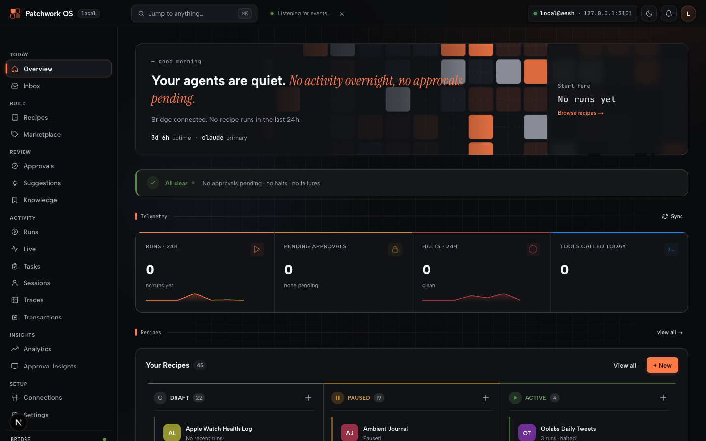

# Patchwork OS

[](https://www.npmjs.com/package/patchwork-os)
[](https://github.com/Oolab-labs/patchwork-os/actions/workflows/ci.yml)
[](https://www.npmjs.com/package/patchwork-os)
[](LICENSE)

### Your personal AI runtime, local-first.

**You decide which model. You decide which actions need a human nod. You own the credentials, the logs, and the deployment.** Nothing phones home unless you [opt in to anonymous analytics](#telemetry).



> Patchwork OS is a local-first personal AI runtime: pluggable model providers, hot-reloadable tools, YAML recipes, a delegation policy with approval queue, and a durable trace memory — all running on your machine, all under your policy.

## Contents

- [Two ways to use it](#the-same-codebase-ships-two-ways-to-use-it)
- [Dashboard only — no editor required](#dashboard-only--no-code-editor-required)
- [Claude IDE Bridge — quick start](#-claude-ide-bridge--quick-start)
- [Windows](#windows)
- [Architecture](#architecture)
- [Telemetry](#telemetry)
- [Contributing & support](#support)

**Five primitives, one runtime:**

- **Tools** — 177 built-in (LSP, git, terminal, debugger, files) plus any plugin you write. Plugins hot-reload — Claude can author a tool mid-session and call it on the next turn. See [Live Toolsmithing](documents/live-toolsmithing.md).
- **Recipes** — YAML automations triggered by cron, file save, git commit, test run, or webhook. Anything that can POST a JSON payload can fire a recipe.
- **Delegation Policy** — three risk tiers, four-source precedence (managed → project-local → project → user). Auto-approve safe, require approval for risky, block dangerous.
- **Trace memory** — every approval, every recipe run, every enrichment is durable JSONL. Past decisions are surfaced into future sessions automatically. Bundle and back up with [`patchwork traces export`](src/commands/tracesExport.ts).
- **OAuth** — turn your runtime into a private personal API. PKCE S256, dynamic client registration, deployable on a VPS in minutes.

> **Why not [an MCP server / Zapier / a hosted assistant / a local agent framework]?** See [the comparison page](documents/comparison.md) for the honest tradeoff against each.
>
> **What does this look like in one diagram?** See the [architecture overview](documents/architecture.md).

---

## The same codebase ships two ways to use it

Pick the layer you need.

| | What you get | Install | Best for |
|---|---|---|---|
| **🔌 Claude IDE Bridge** | MCP bridge connecting Claude Code to your IDE. 177 tools — diagnostics, LSP, debugger, terminal, git, GitHub, file ops. | `npm i -g patchwork-os` then run `claude-ide-bridge` | Anyone who wants Claude Code to see and act on their editor state |
| **🤖 Patchwork OS** | Everything in the bridge **plus** YAML recipes, approval queue, oversight dashboard, mobile push approvals, multi-model providers, JetBrains companion. | Same package, run `patchwork init` | Power users running automation, agent workflows, or background tasks |

Same codebase. Bridge is the foundation; Patchwork OS is the optional layer on top. **No vendor lock-in. Runs on your machine.**

---

## Dashboard Only — No Code Editor Required

> You do not need VS Code, Windsurf, Cursor, or Claude Code CLI to use the Patchwork dashboard.

The dashboard is a standalone Next.js app that communicates with the bridge over HTTP. No editor extension required.

**Prereqs:** [Node.js 22+](https://nodejs.org) · tmux on macOS/Linux (`brew install tmux` / `apt install tmux`) — auto-detected, falls back to background mode if absent. **Windows:** natively supported — no WSL required.

```bash
npx patchwork-os@beta init   # scaffolds ~/.patchwork and generates a dashboard login (no install needed)
patchwork start              # launches bridge + dashboard (auto-detects tmux; falls back to background mode if absent)
```

Open **http://localhost:3200** — that's it. `npx patchwork-os@beta init` auto-generates a dashboard password and saves it to `~/.patchwork/.env` — it prints the password at the end of setup, save it for your first login.

**What you get:** run and schedule YAML recipes, connect external services (Gmail, Calendar, Slack), review AI drafts in the approval queue, read your AI inbox — all from the browser. No coding required.

> **Want IDE features too?** See [Claude IDE Bridge — Quick Start](#-claude-ide-bridge--quick-start) below to add LSP, debugger, and editor tools on top.

---

## 🔌 Claude IDE Bridge — Quick Start

> Developers only — skip to [Dashboard Only](#dashboard-only--no-code-editor-required) above if you just want the web dashboard.

**Prerequisites:** a supported code editor — **VS Code, Cursor, Windsurf, or Google Antigravity** (or JetBrains via the [companion plugin](#jetbrains-plugin)) — plus Node.js 22+ and the [Claude Code CLI](https://docs.anthropic.com/en/docs/claude-code). The bridge's LSP, debugger, and editor-state tools run through the editor extension; without one you're limited to the headless CLI subset.

```bash
# 1. Install the npm package
npm install -g patchwork-os

# 2. Install the VS Code / Cursor / Windsurf extension
#    Search "Claude IDE Bridge" on OpenVSX, or:
claude-ide-bridge install-extension

# 3. Start the bridge for your workspace
claude-ide-bridge --workspace .

# 4. Connect Claude Code (in another terminal)
claude --ide
```

> **First time `claude --ide` says it can't find an IDE?** Claude Code's `--ide`
> flag runs an in-terminal IDE-detection check; a standalone bridge launched from
> a plain terminal trips it, so you need to set `CLAUDE_CODE_IDE_SKIP_VALID_CHECK=true`.
> `patchwork init` writes this into your `~/.claude/settings.json` for you (so a
> plain `claude --ide` just works). If you're only running the bridge (no `init`),
> add it once yourself — Claude Code applies its `env` block to every session:
>
> ```json
> // ~/.claude/settings.json
> { "env": { "CLAUDE_CODE_IDE_SKIP_VALID_CHECK": "true" } }
> ```
>
> Or prefix it for a single run: `CLAUDE_CODE_IDE_SKIP_VALID_CHECK=true claude --ide`.

Type `/ide` in Claude Code to confirm the connection. That's it — Claude now sees your diagnostics, open files, and editor state, and can call 177 tools to act on them.

> ⭐ If this saves you a config file or a debug session, drop a star — it's the only signal I get that it's helping.

**What the bridge gives Claude:**

- Diagnostics, LSP navigation (goto / references / call hierarchy), refactoring with risk analysis
- Terminal — run commands, read output, wait for async work
- Git — status, diff, commit, push, blame, checkout, branch list
- GitHub — open PRs, list issues, post reviews, fetch run logs
- Debugger — set breakpoints, evaluate expressions, inspect runtime state
- Files — read, edit by line range, search and replace, capture screenshots
- Code quality — `auditDependencies`, `detectUnusedCode`, `getCodeCoverage`, `getGitHotspots`

The bridge runs without any flags. No recipes, no automation, no dashboard — just the IDE-Claude connection.

**Compatible IDEs:** VS Code, Cursor, Windsurf, Google Antigravity. JetBrains IDEs via [companion plugin](#jetbrains-plugin).

**Transport layers:**

| Client | Protocol |
|---|---|
| Claude Code CLI | WebSocket `ws://127.0.0.1:<port>` |
| Claude Desktop, Grok Build (Grok CLI) | stdio shim → WebSocket |
| Gemini CLI, Codex CLI, claude.ai | Streamable HTTP + Bearer token |

**Connecting Gemini CLI:**

```bash
# Get the auth token from the bridge's lock file
patchwork-os print-token

# Add the bridge as an MCP server
gemini mcp add patchwork http://127.0.0.1:<port>/mcp \
  --header "Authorization: Bearer <token>"
```

The bridge auto-responds to the GET probe Gemini sends before initializing, so it shows as **Connected** immediately.

**Connecting Grok Build (Grok CLI):**

Grok Build connects over the same **stdio shim** as Claude Desktop. Add this block to `~/.grok/config.toml` (the `--workspace` arg is the important part):

```toml
[mcp_servers.patchwork]
command = "claude-ide-bridge"
args = ["shim", "--workspace", "/absolute/path/to/your/project"]
enabled = true
```

Three gotchas that look like bugs but aren't:

- **`--workspace` is required.** Without it the shim picks the newest bridge lock across *all* workspaces — in a multi-bridge setup (orchestrator, leftover dev bridges) that can be the wrong or a dead bridge, so tools act on the wrong project or hang. Always pin it to your project path.
- **`grok mcp doctor` hangs — don't use it.** The shim is a long-lived relay that stays open for the session, so `doctor` waits forever for it to exit. Verify with the in-TUI **`/mcps`** instead, or run `claude-ide-bridge shim --ping` (one-shot: connects, lists tools, exits).
- **The approval gate can park tool calls.** If `~/.patchwork/config.json` has `"approvalGate": "all"` (or `"high"`), tool calls queue for human approval in the dashboard and look like they're hanging to Grok. Set it to `"high"` (gate only risky writes) or `"off"`, or approve in the dashboard at `localhost:3000`.

Grok Build can also connect over Streamable HTTP + Bearer (same as Gemini, above) if you'd rather not use the shim.

**Tool modes:**

| Mode | Tools | When to use |
|---|---|---|
| Full _(default)_ | 177 | All git, GitHub, terminal, file ops, orchestration |
| Slim (`--slim`) | ~60 | LSP + debugger + editor state only |

Bridge-only docs: [documents/platform-docs.md](documents/platform-docs.md)

---

## Windows

The bridge, VS Code extension, and orchestrator all run **natively on Windows — no WSL required**. Install the same way (`npm install -g patchwork-os`), then start the bridge with `npm run start:bridge` or the full stack with `npm run start-all:node` (cross-platform) / `npm run start-all:win` (PowerShell-native).

A few bash+tmux entry points (`patchwork start`, `npm run remote`) still need WSL2 or Git Bash. Credential storage uses Windows DPAPI.

**Full setup, the orchestrator flag reference, and the native-Windows limitations table:** [docs/windows.md](docs/windows.md).

---

## 🤖 Patchwork OS — Quick Start

```bash
npx patchwork-os@beta init
```

Sets up 5 local recipes, detects Ollama, and opens a terminal dashboard — under 90 seconds.

### ☀️ Morning Brief — the hero workflow

Get an AI digest of your Gmail, calendar, and tasks every morning — or on demand:

```bash
# First-time setup (connect Gmail + Google Calendar)
patchwork-os init
patchwork-os connections connect gmail
patchwork-os connections connect google-calendar

# Run it now
patchwork-os recipe run morning-brief
```

The brief lands in `~/.patchwork/inbox/` as a Markdown file. Open the dashboard (`http://localhost:3200`) to read it, approve any drafted replies, or let it auto-send at 08:00 via the built-in cron trigger.

No connectors yet? Run with `--local` using Ollama — it summarises your clipboard and last-touched files instead.

---

### What it adds on top of the bridge

Patchwork OS is a local automation platform that watches your workspace for events, runs AI-powered recipes in response, and routes anything risky through an approval queue before it goes anywhere.

Think of it as a background agent that acts on your behalf — but asks before sending, writing, or modifying anything consequential.

- Test suite fails on CI → triage note in your inbox before you wake up
- Customer email arrives → draft reply in your voice, pending your approval
- Field-trip permission form flagged → reply drafted to the teacher, waiting for your nod

**Recipes** are plain YAML files. They declare a trigger (cron, file save, git commit, test run, webhook) and an action (run a prompt, write to inbox, call a connector). No code required. Share them like dotfiles.

**Models** are yours. Claude, GPT, Gemini, Grok, or local Ollama. Swap at any time. Nothing phones home unless you opt in (see [Telemetry](#telemetry)).

**Oversight** is non-negotiable. Every write or external action lands in `~/.patchwork/inbox/` for approval. The web UI at `http://localhost:3200` shows pending approvals, live sessions, recipe run history, and local analytics (the dashboard's analytics panel is computed entirely from on-disk logs — it does not transmit anything).

### Patchwork commands

Grouped by what they do. Full list: `patchwork --help`.

**Setup**

```bash
npx patchwork-os@beta init                # one-command first-time setup (no install needed)
patchwork install-extension               # install the VS Code / Cursor / Windsurf extension
patchwork gen-claude-md                   # generate a starter CLAUDE.md for this workspace
patchwork gen-plugin-stub ./my-plugin --name "org/name" --prefix "myPrefix"
```

**Runtime**

```bash
patchwork start                           # bridge + dashboard (auto-detects tmux)
patchwork start-all                       # bridge + extension watcher in tmux
patchwork dashboard                       # launch dashboard standalone
patchwork shim                            # stdio shim for Claude Desktop
patchwork status                          # one-shot health check
patchwork print-token                     # auth token from the active lock file
```

**Recipes & tasks**

```bash
patchwork recipe list                     # installed recipes
patchwork recipe run daily-status         # run one now
patchwork recipe new my-recipe --interactive
patchwork start-task "<description>"      # enqueue a free-form Claude task
patchwork quick-task fixErrors            # context-aware preset task
patchwork continue-handoff                # resume from stored handoff note
patchwork suggest                         # AI-suggest a recipe for a goal
```

**Ops & insight**

```bash
patchwork halts --window overnight        # morning summary of recent recipe halts
patchwork judgments                       # review recent approval / decision traces
patchwork traces export                   # bundle durable trace memory for backup
patchwork launchd                         # macOS LaunchAgent management
patchwork notify <Event>                  # bridge ←→ Claude Code hook wiring
```

**Safety**

```bash
patchwork kill-switch engage              # stop all background automation immediately
patchwork kill-switch status              # is the kill-switch active?
patchwork kill-switch release             # resume automation
patchwork panic                           # alias for `kill-switch engage`
```

### Starter recipes

The package ships these in `templates/recipes/`. Recipes that need API keys are noted; the rest are zero-config.

| Recipe | Trigger | What it does | Needs |
|---|---|---|---|
| `ambient-journal` | git commit | Appends one line to `~/.patchwork/journal/` | — |
| `daily-status` | cron 08:00 | Morning brief from yesterday's commits | — |
| `lint-on-save` | file save | Surfaces new TS/JS diagnostics to inbox | — |
| `stale-branches` | cron weekly | Lists branches older than 30 days | — |
| `watch-failing-tests` | test run | Drops triage note to inbox on failure | — |
| `project-health-check` | manual | Snapshot of repo health + flagged risks | — |
| `ctx-loop-test` | manual | Smoke test for context-platform end-to-end | — |
| `morning-brief` | cron 08:00 | Gmail + Linear + Slack + Calendar digest | Gmail, Linear, Slack, Google Calendar |
| `morning-brief-slack` | cron 08:00 | Same brief but only posts to Slack | Linear, Slack |
| `gmail-health-check` | manual | Verify Gmail connector + token state | Gmail |
| `inbox-triage` | manual | Triage Gmail unread → suggest archive/reply | Gmail |
| `sentry-to-linear` | manual | Sentry issue → Linear ticket (one-shot) | Sentry, Linear |

**Connectors available** (all writes governed by your delegation policy): Slack, GitHub, Linear, Gmail, Google Calendar, Google Drive, Sentry, Notion, Confluence, Datadog, HubSpot, Intercom, Stripe, Zendesk, Jira, PagerDuty, Discord, Asana, GitLab.

**Delegation policy presets** ([`templates/policies/`](templates/policies/)): five persona starters — conservative, developer, headless-CI, regulated-industry, personal-assistant. Copy one into `~/.patchwork/config.json` and restart.

**Webhook recipe starters** ([`templates/recipes/webhook/`](templates/recipes/webhook/)): six webhook-triggered recipes — capture-thought, morning-brief (on-demand), meeting-prep, incident-intake, customer-escalation, apple-watch-health-log. Anything that can POST HTTP can drive these — iPhone Shortcut, Stream Deck, Home Assistant, NFC tag, monitoring tool.

### Automation hooks

Event-driven hooks trigger Claude tasks automatically. Activate with `--automation --automation-policy <path.json> --driver subprocess`.

Key hooks:

| Hook | Fires when |
|---|---|
| `onFileSave` | Matching files saved |
| `onDiagnosticsStateChange` | Errors appear or clear |
| `onRecipeSave` | Any `.yaml`/`.yml` saved — runs preflight |
| `onGitCommit` / `onGitPush` / `onGitPull` | Git tools succeed |
| `onTestRun` | Test run completes (filter: any/failure/pass-after-fail) |
| `onBranchCheckout` | After branch switch |
| `onPullRequest` | After `githubCreatePR` succeeds |
| `onCompaction` | Before/after Claude context compaction |
| `onTaskCreated` / `onTaskSuccess` | Orchestrator task lifecycle |

All hooks support inline prompts, named prompt references, and a minimum 5s cooldown. Full reference: [documents/platform-docs.md → Automation Hooks](documents/platform-docs.md)

---

## More features

### 🖥️ Cowork (computer-use handoff)

Hand a task off to Claude's computer-use sandbox without losing IDE context. Run `/mcp__bridge__cowork` in a regular Claude chat to snapshot editor state, then open Cowork — it reads the handoff note for instant continuity. Cowork runs in an isolated git worktree. See [docs/cowork.md](docs/cowork.md).

### 🔐 OAuth 2.0 — turn your runtime into a personal API

Start the bridge with `--issuer-url https://your-domain.com` to expose a full OAuth 2.0 surface: PKCE S256, dynamic client registration (RFC 7591), `/oauth/authorize` approval page, opaque 24h access tokens. Connect claude.ai, Codex CLI, or any MCP client over Streamable HTTP. See [docs/remote-access.md](docs/remote-access.md).

### 🛑 Kill-switch — stop everything, now

`patchwork kill-switch engage` (or the `patchwork panic` alias) halts all running automation, recipes, and orchestrator tasks immediately. `patchwork kill-switch status` reports state; `release` resumes. Designed for the moment you realise an agent is doing the wrong thing.

### 🪟 Native Windows support

Bridge, VS Code extension, smoke harness, and CI are all green on native Windows — no WSL required. See [Windows Quick Start](#-windows-quick-start) above.

### ☀️ Morning summary

`patchwork halts --window overnight` prints a one-screen digest of recipe halts (categorised, 5 most recent reasons). Pair with `patchwork judgments` to review what Claude decided overnight before approving anything.

### 🛒 Recipe marketplace — install + submit from the dashboard

Browse the curated registry at [github.com/patchworkos/recipes](https://github.com/patchworkos/recipes) at **`/marketplace`** in the dashboard. One-click install if the bridge is running, with risk + connector preview before fetch.

Contributing a recipe? **`/marketplace/submit`** is a full in-app submission flow: starter YAML presets (manual / scheduled / webhook), live `recipe.json` manifest preview, auto-save draft in `sessionStorage`, lint via the bridge before submit, and a "Submit to GitHub" button that opens a prefilled create-file PR on the registry repo. GitHub auto-forks for users without push access — no extra accounts needed.

---

## Architecture

```
patchwork-os (npm package)
│
├── claude-ide-bridge          ← run alone for bridge-only mode
│   ├── MCP server             177 tools over WebSocket / HTTP / stdio
│   ├── VS Code extension      LSP, debugger, editor state, live diagnostics
│   ├── Git / GitHub           gitCommit, gitPush, githubCreatePR, …
│   ├── Terminal               runInTerminal, getTerminalOutput, …
│   └── Code quality           auditDependencies, detectUnusedCode, getCodeCoverage
│
└── patchwork                  ← run for full Patchwork OS layer
    ├── Recipe runner          YAML triggers → LLM prompt → action
    ├── Connectors             Linear, Sentry, Slack, Google Calendar, +
    ├── Orchestrator           Claude subprocess tasks, automation hooks
    ├── Oversight inbox        ~/.patchwork/inbox/ — approval queue
    └── Web dashboard          http://localhost:3200 — approvals, sessions, analytics
```

The npm package ships **three CLI binaries** that share the same code:

| Binary | Default behavior |
|---|---|
| `claude-ide-bridge` | Bridge only — no automation, no recipe runner, no dashboard |
| `patchwork` | Full Patchwork OS — automation + recipes + dashboard |
| `patchwork-os` | Alias for `patchwork` |

Use whichever fits your mental model.

---

## Tool surface

177 MCP tools across 15 categories. Highlights:

| Category | Tools |
|---|---|
| LSP / Code Intelligence | `getDiagnostics`, `goToDefinition`, `findReferences`, `getCallHierarchy`, `renameSymbol`, `refactorAnalyze`, `explainSymbol`, … (34 tools) |
| Git | `getGitStatus`, `getGitDiff`, `gitCommit`, `gitPush`, `gitCheckout`, `gitBlame`, … (16 tools) |
| GitHub | `githubCreatePR`, `githubListPRs`, `githubCreateIssue`, `githubPostPRReview`, … (13 tools) |
| Terminal | `runInTerminal`, `createTerminal`, `getTerminalOutput`, `waitForTerminalOutput` |
| File Operations | `editText`, `searchAndReplace`, `searchWorkspace`, `findFiles`, `getFileTree`, … |
| Debugger | `setDebugBreakpoints`, `startDebugging`, `evaluateInDebugger` |
| Orchestrator | `runClaudeTask`, `listClaudeTasks`, `getClaudeTaskStatus` |
| Context Platform | `ctxGetTaskContext`, `ctxQueryTraces`, `ctxSaveTrace`, `enrichStackTrace` |

Full reference: [documents/platform-docs.md](documents/platform-docs.md)

---

## Plugin system

Extend the tool surface without forking the bridge.

```bash
# Scaffold a new plugin
patchwork gen-plugin-stub ./my-plugin --name "org/name" --prefix "myPrefix"

# Load at runtime
claude-ide-bridge --plugin ./my-plugin
```

Plugins register MCP tools in-process. With `--plugin-watch`, the bridge reloads them on save — Claude can write a tool *during* a session and use it on the next turn. See [documents/live-toolsmithing.md](documents/live-toolsmithing.md) for the worked walkthrough and [examples/plugins/sqlite-library/](examples/plugins/sqlite-library/) for a runnable example.

Publish to npm with keyword `claude-ide-bridge-plugin` for distribution.

Full reference: [documents/plugin-authoring.md](documents/plugin-authoring.md)

---

## JetBrains plugin

Companion IntelliJ plugin (v1.0.0) on the JetBrains Marketplace. Covers 49 handlers: core tools, PSI-based LSP (goto, references, hover, rename, symbols, format), XDebugger integration, and code style tools.

Use the same bridge from VS Code and JetBrains IDEs simultaneously — IntelliJ IDEA, PyCharm, GoLand, WebStorm, and other IntelliJ-platform editors.

Source: [intellij-plugin/](intellij-plugin/)

---

## Remote deployment

Run headless on a VPS with full tool support via VS Code Remote-SSH.

```bash
claude-ide-bridge --bind 0.0.0.0 \
  --issuer-url https://your-domain.com \
  --fixed-token <uuid> \
  --vps
```

Systemd service and deploy scripts in [`deploy/`](deploy/). Full guide: [docs/remote-access.md](docs/remote-access.md).

---

## What's shipped

| Feature | Status |
|---|---|
| 177 MCP tools (LSP, git, tests, debugger, diagnostics) | **shipped** |
| VS Code / Cursor / Windsurf / Antigravity extension | **shipped** |
| JetBrains plugin (49 handlers) | **shipped** |
| `patchwork init` — one-command setup | **shipped** |
| Terminal dashboard | **shipped** |
| Web oversight UI (approvals, sessions, recipes) | **shipped** |
| Recipe runner (YAML, cron, manual, webhook) | **shipped** |
| Multi-provider LLM (Claude, Gemini, OpenAI, Grok, Ollama) | **shipped** |
| Connectors: Linear, Sentry, Slack, Google Calendar, Intercom, HubSpot, Datadog, Stripe | **shipped** |
| Cross-session memory (traces, handoff notes) | **shipped** |
| Mobile oversight PWA (push approvals) | **shipped** |
| Community recipe bundles (`patchwork recipe install github:<org>/<repo>`) | **shipped** |
| Community recipe registry / discovery UI | TBD |

---

## Install from source

```bash
git clone https://github.com/Oolab-labs/patchwork-os
cd patchwork-os
npm install && npm run build

# Pack first — do NOT use `npm install -g .`
# Symlink installs break the macOS LaunchAgent (EPERM at startup)
npm pack
npm install -g patchwork-os-*.tgz
patchwork init
```

---

## Telemetry

Patchwork ships an **opt-in** anonymous usage summary. It is **disabled by default** — the bridge sends nothing unless you explicitly turn it on.

**If you opt in**, on bridge shutdown an aggregate summary is POSTed to `https://analytics.claude-ide-bridge.dev/v1/usage`:

- Total session count and total tool-call count (no per-call payloads)
- Tool name → call count + median/p95 latency, capped at the top-N tools
- Bridge version, Node version, OS family (`darwin` / `linux` / `win32`)
- A per-install random salt (regenerated at any time by deleting `~/.claude/ide/analytics-salt`) used to coalesce repeated installs from the same machine without sending machine identifiers

**What is never sent:** workspace paths, file contents, prompts, tool arguments, tool output, project names, git history, credentials, IPs (transport-level only, dropped server-side), or anything from `~/.patchwork/`.

**How to opt in:** set `analyticsEnabled: true` in the dashboard's Settings panel, or write `{"enabled": true, "decidedAt": "<iso>"}` to `~/.claude/ide/analytics.json` (mode 0600).

**How to opt out / stay out:** do nothing. Default state is `null` (no preference) which behaves as opt-out. To explicitly opt out and silence future prompts, write `{"enabled": false, ...}` to the same file.

**Source:** [src/analyticsSend.ts](src/analyticsSend.ts), [src/analyticsAggregator.ts](src/analyticsAggregator.ts), [src/analyticsPrefs.ts](src/analyticsPrefs.ts) — endpoint is hardcoded (not runtime-configurable, by design, to prevent redirect attacks).

---

## Documentation

| Doc | Contents |
|---|---|
| [documents/platform-docs.md](documents/platform-docs.md) | Full tool reference (177 tools), automation hooks, connectors |
| [documents/prompts-reference.md](documents/prompts-reference.md) | All 36 MCP prompts |
| [documents/styleguide.md](documents/styleguide.md) | Code conventions, UI patterns |
| [documents/roadmap.md](documents/roadmap.md) | Development direction |
| [documents/data-reference.md](documents/data-reference.md) | Data flows, state management, protocol details |
| [documents/plugin-authoring.md](documents/plugin-authoring.md) | Plugin manifest schema, entrypoint API, distribution |
| [documents/live-toolsmithing.md](documents/live-toolsmithing.md) | Write tools while the AI is using them — hot-reload narrative + worked example |
| [documents/triggers.md](documents/triggers.md) | Anything Can Trigger Your AI — iPhone Shortcuts, Stream Deck, Home Assistant, curl, GitHub Actions |
| [documents/speculative-refactoring.md](documents/speculative-refactoring.md) | Stage multi-file edits, review the diff, commit or discard — honest about commit-phase semantics |
| [documents/architecture.md](documents/architecture.md) | One-page architecture diagram + how to read it |
| [documents/comparison.md](documents/comparison.md) | Patchwork vs MCP server / Zapier / hosted assistants / agent frameworks — honest tradeoffs |
| [docs/adr/](docs/adr/) | Architecture Decision Records |
| [docs/remote-access.md](docs/remote-access.md) | VPS deployment guide |

---

## Support

- **Bugs & feature requests:** [GitHub Issues](https://github.com/Oolab-labs/patchwork-os/issues)
- **Questions & community:** [GitHub Discussions](https://github.com/Oolab-labs/patchwork-os/discussions)
- **Contributing:** see [CONTRIBUTING.md](CONTRIBUTING.md)

---

## License

MIT © Oolab Labs
