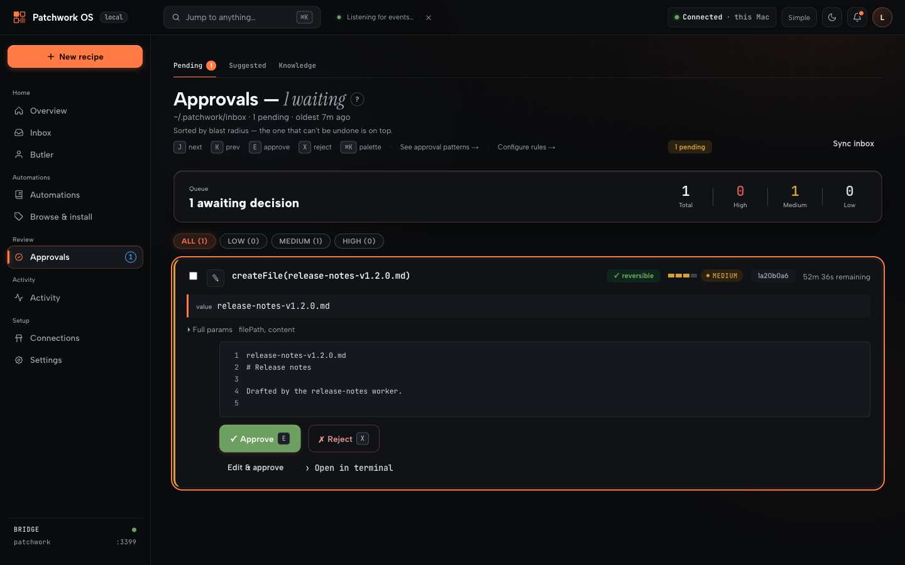
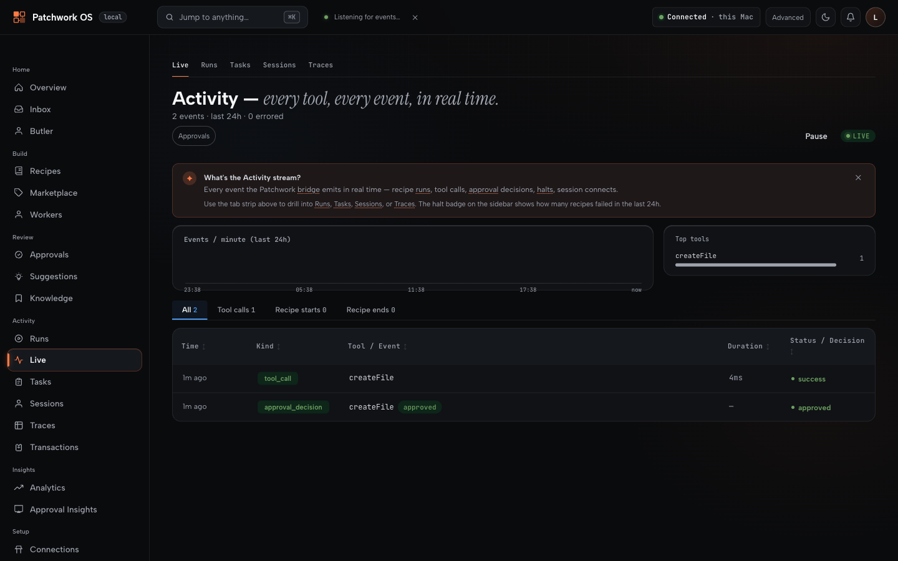

# Patchwork OS

[](https://www.npmjs.com/package/patchwork-os)
[](https://github.com/Oolab-labs/patchwork-os/actions/workflows/ci.yml)
[](https://www.npmjs.com/package/patchwork-os)
[](LICENSE)

> **You don't have an automation problem. You have a decision problem.**

Every AI-agent horror story ends the same way: an action nobody stopped to question. Patchwork OS is the layer between the agent's impulse and the action — a local-first runtime where your AI can automate real work across your editor, GitHub, Slack, Gmail, and 45+ services, while **anything consequential can be made to stop and ask you first**.

**Who it's for:** developers and technical operators who already run agents against real systems — a repo that ships, an inbox that matters, a production service — and who want a record of what was allowed and why. It expects a terminal, a Node install, and comfort editing YAML.

Three ideas, one runtime:

- **Ask before acting.** Every action is classified by blast radius — can it be undone, and how much breaks if it's wrong? Reversible things flow freely. Risky things wait in an approval queue with the evidence attached: what exactly will run, why it fired, and what happens if it's wrong.

- **Trust is earned, never assumed.** Workers — named agents with jobs — start supervised and earn independence from their track record, per action type. Good at filing issues ≠ allowed to push code. One bad high-stakes action outweighs a hundred trivial successes. You set the ceiling; the math never raises it for them.

- **Every decision leaves a receipt.** What was done, why it was allowed, and how it turned out — durable, replayable, explainable via `patchwork judgments`, the dashboard's traces page, and `patchwork gate explain`. When you approve something, you find out later whether you were right.

**An agent wants to write a file. With the gate on, it waits — and shows you exactly what it would do:**



**You approve. The call proceeds, and both halves are on the record:**



## Status: beta

Version `1.2.0-beta.x`. The decision layer, recipes, connectors and IDE bridge all work and are dogfooded daily, but interfaces still move between betas and some surfaces are rougher than others. Pin an exact version if you are building on it.

**The safety features are opt-in, not the default.** This matters more than any other line in this README:

| Feature | Default | Turn it on with |
|---|---|---|
| Approval queue | **off** (`approvalGate: "off"`) | `--approval-gate high` or `all` |
| Worker autonomy gate | **off** | `PATCHWORK_FLAG_WORKER_AUTONOMY=1` (needs `--driver subprocess`) |
| Kill switch | available always | `patchwork panic` |
| Telemetry | **off** | opt in explicitly ([details](#telemetry)) |

Install Patchwork and nothing is gated until you say so. A fresh install is an automation runtime, and it becomes a decision layer when you switch the gate on. Everything above about "stops and asks you first" describes what the gate does once enabled — not what happens out of the box.

## The loop

```
trigger → recipe/worker → reversible?           → runs
                        → risky, gate on        → approval queue → your yes → receipt
                        → risky, gate off       → runs
                        → forbidden by policy   → refused (no approval unlocks it)
```

`patchwork panic` blocks every write-tier tool call across all running bridges, immediately. Reads keep working, and in-flight reasoning is not killed — it is a write block, not a full stop.

## Install

```bash
npm install -g patchwork-os@beta
patchwork-os init
```

`init` scaffolds `~/.patchwork`, seeds local-only recipes, and registers Patchwork's PreToolUse hook in `~/.claude/settings.json`. Restart Claude Code afterwards — it reads hooks at session start.

**Prereqs:** Node 22+. macOS, Linux, and native Windows (no WSL).

Two things worth knowing before you start:

- **Use a global install, not `npx`.** `npx` does not persist the binary, so the very next command in any guide will not be found.
- **The web dashboard is not in the npm package.** It's a Next.js app that needs its own build, so it ships with the repo:
  ```bash
  git clone https://github.com/Oolab-labs/patchwork-os && cd patchwork-os/dashboard
  npm install && npm run build && npm start   # http://localhost:3200
  ```
  Everything below works from the CLI without it. The dashboard is where approvals, traces and connector setup are pleasant rather than possible.

## First run: zero connectors

Prove the runtime works before wiring any service to it. `daily-status` touches only git and local files — no accounts, no network:

```bash
patchwork recipe run daily-status
```

It reads your commits since yesterday plus `~/.patchwork/planned.md`, and writes a Markdown digest to `~/.patchwork/inbox/daily-status-<date>.md`. If that file exists, your install is sound.

Useful neighbours: `patchwork recipe list`, `patchwork status`, `patchwork recipe doctor <name>` when something misbehaves.

## Morning Brief: the connected workflow

```bash
patchwork-os init --with-connectors   # seeds the connector-backed recipes
patchwork connect gmail
patchwork connect google-calendar
patchwork connect github
patchwork connect linear
patchwork recipe run morning-brief
```

The recipe pulls unread mail, today's calendar, your open GitHub issues and PRs, Linear issues, and local git activity, then has a model summarise them into one Markdown brief in `~/.patchwork/inbox/`. Its email step is **triage** — it lists what needs an answer; it does not compose or send replies. Nothing leaves your machine except the API calls to the services you connected.

All four connectors are required as written — no step is guarded, so a missing one halts the run. Drop the steps you don't want, or start from `daily-status` and add sources one at a time.

Requires a working model driver (`--driver subprocess` with the Claude CLI on PATH, or an API key). `patchwork recipe preflight templates/recipes/morning-brief.yaml` lists exactly what a recipe needs before you run it.

## Two ways to run this

**As an automation runtime** — recipes, workers, connectors, the decision layer. Needs `~/.patchwork` and a model driver; an editor is optional.

```bash
patchwork start        # bridge + Claude + dashboard
```

`patchwork start` launches `claude --ide` alongside the bridge, so it expects the **Claude CLI on your PATH**. Use `patchwork start --no-dashboard`, or run the bridge alone with `patchwork --workspace .`, if you don't want that.

On a global npm install there is no `dashboard/` to start, so it logs a dashboard warning and carries on with bridge + Claude; pass `--no-dashboard` to silence it. From a repo clone it starts all three.

**As a standalone IDE bridge** — 180 MCP tools giving Claude Code eyes and hands in your editor: diagnostics, LSP navigation, refactoring with risk analysis, debugger, terminal, git/GitHub, file ops. No `~/.patchwork`, no recipes, no gate.

```bash
npm install -g patchwork-os
claude-ide-bridge install-extension     # VS Code / Cursor / Windsurf / Antigravity
claude-ide-bridge --workspace .
claude --ide                            # in another terminal
```

JetBrains via a companion plugin. Claude Desktop, Gemini CLI, Codex CLI, Grok Build, and claude.ai connect over stdio or HTTP. Use the bridge alone forever if that's all you need; the runtime is an optional layer on top.

`claude --ide` can't find an IDE? Set `CLAUDE_CODE_IDE_SKIP_VALID_CHECK=true` (`init` does this for you).

## What "local-first" does and doesn't mean

**On your machine:** the runtime, every recipe and worker, all credentials and connector tokens, the approval queue, and every log and decision receipt under `~/.patchwork/`. Nothing is uploaded, and no Patchwork-operated server sits in any path.

**Over the network, necessarily:** calls to whatever model you point it at (Anthropic, OpenAI, Google, xAI) and to every connector you authorise (Gmail, GitHub, Slack…). Prompts, and whatever context a step feeds them, go to that model provider. Choosing a local Ollama endpoint keeps inference on your machine too; connector calls still leave it, because that is what a connector is.

**Only if you opt in:** [anonymous analytics](#telemetry).

Other boundaries worth knowing: `runCommand` executes only allowlisted commands, `sendHttpRequest` blocks private and loopback ranges, and file tools refuse symlink escapes out of the workspace. Remote deployments must sit behind TLS with OAuth 2.0 — see [docs/remote-access.md](docs/remote-access.md).

## What's here

- **Decision layer** — approval queue · blast-radius action classes · worker trust ramp · kill switch · decision receipts

- **Automation** — YAML recipes · cron/file/git/test/webhook triggers · event hooks · multi-model (Claude, GPT, Gemini, Grok, Ollama)

- **Connectors** — 45+, all writes governed by your policy: GitHub, Slack, Gmail, Calendar, Drive, Linear, Jira, Sentry, Notion, Stripe, PagerDuty, Datadog, …

- **IDE bridge** — 180 MCP tools · VS Code-family extension · JetBrains plugin · plugins hot-reload (write tools mid-session)

- **Oversight** — web dashboard · mobile push approvals (PWA) · halts/judgments CLI · trace memory across sessions

- **Deployment** — your laptop · headless VPS with OAuth 2.0 ([guide](docs/remote-access.md)) · native Windows

Recipes are plain YAML: a trigger (cron, file save, git commit, test run, or any webhook — iPhone Shortcut, Stream Deck, Home Assistant) plus steps. Share them like dotfiles, install them from the marketplace, or let the dashboard generate one from a sentence.

Workers are recipes with an identity and a track record. A worker that triages failing CI starts by only proposing ("this looks like a real break — file an issue?"). Confirm its filings were real and it earns a longer leash — for that job only. It can be demoted in one bad day. You can cap any worker permanently with one line of YAML.

Why not Zapier / an MCP server / a hosted assistant? Honest tradeoffs: [documents/comparison.md](documents/comparison.md).

## Docs

[Platform reference](documents/platform-docs.md) · [Recipes & triggers](documents/triggers.md) · [Worker autonomy](docs/worker-autonomy-policy-gate.md) · [Plugin authoring](documents/plugin-authoring.md) · [Architecture](documents/architecture.md) · [Windows](docs/windows.md) · [ADRs](docs/adr)

## Telemetry

Off by default; nothing is sent unless you opt in. If you do: aggregate counts and latencies only — never paths, prompts, file contents, arguments, or anything from `~/.patchwork/`. [Details](docs/privacy-policy.md) & [source](src/analyticsSend.ts).

## Contributing & support

[Issues](https://github.com/Oolab-labs/patchwork-os/issues) · [Discussions](https://github.com/Oolab-labs/patchwork-os/discussions) · [CONTRIBUTING.md](CONTRIBUTING.md)

⭐ If this saved you a config file or a blown deploy, a star is the only signal I get that it's helping.

MIT © Oolab Labs — [what that covers](LICENSING.md) · [name and marks](TRADEMARK.md)
