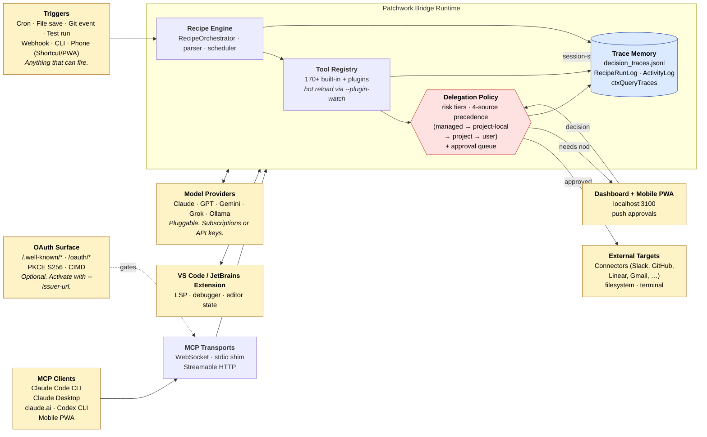
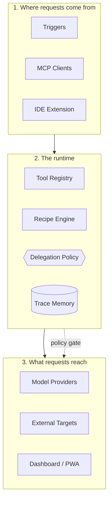

# Architecture

> One runtime. Bring your own model. Bring your own triggers. Every action passes through a policy you wrote and a log you own.

The diagram below describes how the seven external surfaces (model providers, triggers, MCP clients, OAuth, dashboard, IDE extensions, external targets) connect to the four internal subsystems of the bridge runtime. Every clause in the [canonical positioning sentence](../README.md) maps to a box on this diagram.

## How to read this

The five primitives from the [canonical positioning sentence](../README.md) line up with the four boxes inside the **Patchwork Bridge Runtime** subgraph:

| Sentence clause | Box | Why this box |
|---|---|---|
| *pluggable model providers* | (Model Providers ↔ Bridge) | Bridge is provider-agnostic; arrow direction is bidirectional because LLM round-trips can originate from either side |
| *hot-reloadable tools* | Tool Registry | The `--plugin-watch` flag re-registers atomically on plugin file changes |
| *YAML recipes* | Recipe Engine | RecipeOrchestrator + parser + scheduler |
| *delegation policy with approval queue* | Delegation Policy (gate-shaped) | Every tool dispatch passes through this — it's a structural checkpoint, not a sidecar |
| *durable trace memory* | Trace Memory (cylinder) | Three log files under `~/.patchwork/` plus the activity log under `~/.claude/ide/` |

## Five things to notice

1. **Every outbound action passes through the policy gate.** The arrow from Tool Registry to External Targets does *not* exist as a direct edge — it goes through Delegation Policy first. This is the structural invariant that makes "delegation policy" load-bearing rather than decorative. See [src/approvalHttp.ts](../src/approvalHttp.ts) for the implementation.

2. **Trace Memory is the only multi-source sink.** Tool calls, policy decisions, and recipe runs all write to the same trace store. That's what makes [`patchwork traces export`](../src/commands/tracesExport.ts) a single bundle and what makes the (planned) Decision Replay Debugger possible.

3. **Triggers are inputs, not outputs.** Cron, file save, git, test run, webhook, CLI, and the mobile PWA all enter at the same point — the Recipe Engine. The trigger surface is the *non-developer onboarding* story; recipes don't care which trigger fired them.

4. **OAuth is optional and only gates one transport.** The bridge runs without `--issuer-url` and accepts WebSocket / stdio clients on the loopback interface only. OAuth activates the Streamable HTTP transport for remote MCP clients (claude.ai, the mobile PWA). See [src/oauth.ts](../src/oauth.ts).

5. **The dashboard is a policy reader, not a separate brain.** Approval prompts come *from* the Delegation Policy (when a human nod is required) and decisions flow *back* into the Delegation Policy. The dashboard does not have its own approval state; it is a UI over the bridge's queue. See [src/approvalQueue.ts](../src/approvalQueue.ts) and [dashboard/src/app/approvals/](../dashboard/src/app/approvals/).

## What's not in the diagram

Things that exist but are deliberately omitted to keep the page legible:

- **Per-language LSP fallbacks** (TypeScript LS, ctags, etc.) for when the IDE extension is disconnected.
- **Plugin watcher** as a separate component — folded into Tool Registry.
- **Session checkpoint / handoff** — operates orthogonally to this diagram.
- **Connector OAuth flows** (Gmail, Slack, etc.) — separate from the bridge OAuth surface; lives inside the connector implementations.

For the unabridged tour: [documents/data-reference.md](data-reference.md) and [documents/platform-docs.md](platform-docs.md).

---

## Layered view

If the flowchart above is too dense, the same architecture in three layers:

The compression is honest: every request enters at layer 1, every effect lands at layer 3, and layer 2 — *the runtime* — is the part that distinguishes Patchwork from each of the alternatives in [comparison.md](comparison.md).
